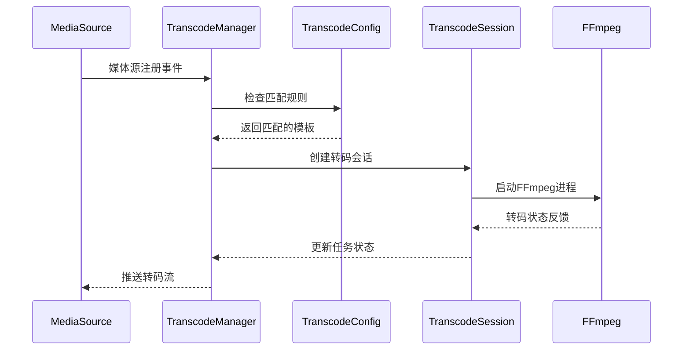
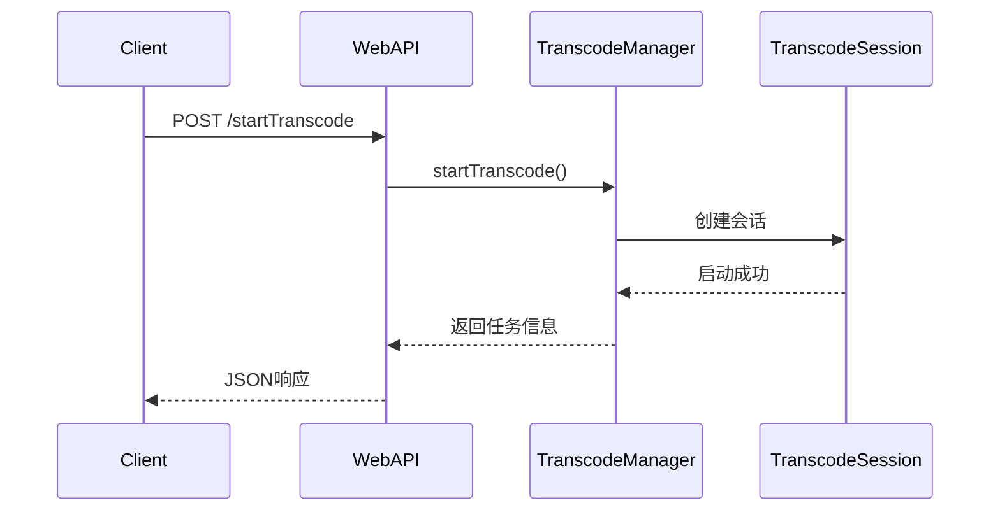

# ZLMediaKit 转码模块设计与集成文档

## 📋 目录
- [概述](#概述)
- [架构设计](#架构设计)
- [核心组件](#核心组件)
- [集成方案](#集成方案)
- [配置系统](#配置系统)
- [API接口](#api接口)
- [工作流程](#工作流程)
- [技术实现](#技术实现)
- [扩展与优化](#扩展与优化)

## 概述

ZLMediaKit转码模块是在原有开源版本基础上，通过Claude Code指导设计并实现的企业级转码解决方案。该模块完全集成到ZLMediaKit核心框架中，提供高性能、可扩展的实时流媒体转码能力。

### 设计目标
- **高性能**：支持GPU硬件加速，单机支持数十路并发转码
- **低延迟**：优化的转码流水线，最低延迟可达100-300ms
- **易集成**：与ZLMediaKit无缝集成，无需修改现有业务逻辑
- **智能化**：支持按需转码、自动规则匹配、资源智能调度
- **可运维**：完整的监控体系、状态管理和故障恢复机制

### 技术特性
- 基于FFmpeg的转码引擎，支持NVENC/QSV/VCE硬件加速
- 模板化配置系统，支持动态规则引擎
- 异步任务调度，支持高并发转码会话管理
- RESTful API接口，提供完整的生命周期管理
- 与ZLMediaKit媒体源系统深度集成

## 架构设计

### 整体架构

```
┌─────────────────────────────────────────────────────────────┐
│                    ZLMediaKit 主框架                        │
├─────────────────────────────────────────────────────────────┤
│                      转码模块                               │
│  ┌─────────────────┐  ┌─────────────────┐  ┌──────────────┐ │
│  │ TranscodeConfig │  │TranscodeManager │  │TranscodeSess │ │
│  │   配置管理       │  │   任务管理       │  │   会话管理    │ │
│  └─────────────────┘  └─────────────────┘  └──────────────┘ │
├─────────────────────────────────────────────────────────────┤
│                    集成接口层                               │
│  ┌─────────────────┐  ┌─────────────────┐  ┌──────────────┐ │
│  │   WebAPI集成    │  │  MediaSource集成 │  │   Hook集成   │ │
│  │  (HTTP接口)     │  │   (媒体源监听)   │  │  (事件通知)   │ │
│  └─────────────────┘  └─────────────────┘  └──────────────┘ │
├─────────────────────────────────────────────────────────────┤
│                    ZLMediaKit 核心                          │
│     媒体源管理 | 协议栈 | 网络层 | 配置系统                   │
└─────────────────────────────────────────────────────────────┘
```

### 模块分层

**应用层**
- WebAPI接口：提供HTTP RESTful API
- 事件系统：集成ZLMediaKit事件通知机制

**业务层**
- TranscodeManager：转码任务调度和管理
- TranscodeSession：单个转码会话的生命周期管理
- TranscodeConfig：配置解析和模板管理

**基础层**
- FFmpeg集成：进程管理和输出解析
- 媒体源集成：与ZLMediaKit媒体流系统对接
- 资源管理：并发控制和资源调度

## 核心组件

### 1. TranscodeConfig - 配置管理器

**职责**：
- 解析和管理转码配置参数
- 维护转码模板和规则引擎
- 提供配置验证和热重载

**核心特性**：
```cpp
class TranscodeConfig {
public:
    // 基础配置
    bool isEnabled() const;
    int maxConcurrent() const;
    HWAccelType hwAccelType() const;
    
    // 模板管理
    std::shared_ptr<TranscodeTemplate> getTemplate(const std::string &name) const;
    std::vector<std::string> getMatchedTemplates(const std::string &app, const std::string &stream) const;
    
    // 规则引擎
    bool addRule(const TranscodeRule &rule);
    std::vector<TranscodeRule> getAllRules() const;
};
```

**配置结构**：
- 基础配置：并发数、硬件加速、超时设置
- 模板配置：预定义的FFmpeg参数模板
- 规则配置：基于通配符的自动匹配规则

### 2. TranscodeManager - 任务管理器

**职责**：
- 转码任务的创建、调度和销毁
- 资源池管理和并发控制
- 媒体源事件监听和按需转码

**核心特性**：
```cpp
class TranscodeManager {
public:
    // 任务管理
    bool startTranscode(const std::string &app, const std::string &stream, 
                       const std::vector<std::string> &templates);
    bool stopTranscode(const std::string &app, const std::string &stream);
    
    // 查询接口
    std::vector<TranscodeTaskInfo> getAllTasks() const;
    TranscodeTaskInfo getTask(const std::string &app, const std::string &stream) const;
    
    // 统计信息
    int getRunningTaskCount() const;
    std::vector<TranscodeInfo> getRunningSessionsInfo() const;
    
    // 媒体源事件
    void onMediaSourceRegist(MediaSource &source, bool regist);
    void onMediaSourceNoneReader(MediaSource &source);
};
```

**任务调度**：
- 异步任务队列，支持高并发处理
- 智能资源调度，避免系统过载
- 自动故障恢复和重试机制

### 3. TranscodeSession - 会话管理器

**职责**：
- 单个转码会话的完整生命周期管理
- FFmpeg进程启动、监控和控制
- 实时状态统计和进度报告

**核心特性**：
```cpp
class TranscodeSession {
public:
    // 会话控制
    bool start(const onTranscodeResult &callback);
    void stop();
    
    // 状态查询
    TranscodeInfo getInfo() const;
    bool isRunning() const;
    
    // 进度监控
    void setProgressCallback(const std::function<void(const TranscodeInfo &)> &callback);
};
```

**状态机**：
```
Idle → Starting → Running → Stopping → Stopped
  ↓                  ↓         ↓
Error ←─────────────────────────┘
```

## 集成方案

### 1. 编译时集成

**CMake配置**：
```cmake
# CMakeLists.txt
option(ENABLE_TRANSCODE "Enable Transcode" ON)

if(ENABLE_TRANSCODE)
  update_cached_list(MK_COMPILE_DEFINITIONS ENABLE_TRANSCODE)
  message(STATUS "Transcode module enabled")
endif()
```

**条件编译**：
```cpp
#ifdef ENABLE_TRANSCODE
#include "../src/Transcode/TranscodeManager.h"
#include "../src/Transcode/TranscodeConfig.h"
#endif
```

### 2. 运行时集成

**主程序集成**：`server/main.cpp:405`
```cpp
#if defined(ENABLE_TRANSCODE)
    // 启动转码管理器
    if (TranscodeManager::Instance().start()) {
        InfoL << "已启动转码管理器";
    } else {
        WarnL << "转码管理器启动失败";
    }
#endif
```

**WebAPI集成**：`server/WebApi.cpp:2327-2563`
- 6个RESTful API接口完全集成
- 统一的错误处理和响应格式
- 安全认证和权限控制

### 3. 媒体源集成

**自动发现机制**：
```cpp
void TranscodeManager::onMediaSourceRegist(MediaSource &source, bool regist) {
    if (regist) {
        // 检查是否匹配转码规则
        auto templates = TranscodeConfig::Instance().getMatchedTemplates(
            source.getApp(), source.getId());
        if (!templates.empty()) {
            // 自动启动转码
            startTranscode(source.getApp(), source.getId(), templates);
        }
    }
}
```

**按需转码**：
```cpp
void TranscodeManager::onMediaSourceNoneReader(MediaSource &source) {
    // 无观看者时停止转码
    if (hasTask(source.getApp(), source.getId())) {
        stopTranscode(source.getApp(), source.getId());
    }
}
```

## 配置系统

### 配置文件结构

**基础配置** `[transcode]`
```ini
enable=1                    # 启用转码功能
maxConcurrent=8            # 最大并发数
hwAccel=nvidia             # 硬件加速类型
tempDir=./temp/transcode   # 临时目录
timeoutSec=120            # 超时时间
ffmpegBin=/usr/bin/ffmpeg # FFmpeg路径
autoStart=1               # 自动启动
```

**模板配置** `[transcode_templates]`
```ini
# GPU加速模板
720p=-vcodec h264_nvenc -preset p4 -rc vbr -cq 23 -b:v 2000k -maxrate 3000k -bufsize 4000k -vf scale_cuda=1280:720 -acodec aac -b:a 128k

# CPU备用模板  
720p_cpu=-vcodec libx264 -preset fast -b:v 2000k -vf scale=1280:720 -acodec aac -b:a 128k
```

**规则配置** `[transcode_rules]`
```ini
live/*=480p,720p,1080p     # 直播流多码率转码
record/*=720p              # 录制流单码率转码
```

### 配置热重载

支持运行时重新加载配置，无需重启服务：
```cpp
void TranscodeConfig::reloadConfig() {
    std::lock_guard<std::mutex> lock(_mutex);
    loadConfig();
    // 通知管理器配置变更
    NoticeCenter::Instance().emitEvent(Broadcast::kBroadcastTranscodeConfigChanged);
}
```

## API接口

转码模块提供6个完整的RESTful API接口：

### 1. 启动转码 - `/index/api/startTranscode`
```bash
POST /index/api/startTranscode?secret=xxx&app=live&stream=test&templates=720p,480p
```

### 2. 停止转码 - `/index/api/stopTranscode`  
```bash
POST /index/api/stopTranscode?secret=xxx&app=live&stream=test
```

### 3. 任务列表 - `/index/api/getTranscodeList`
```bash
GET /index/api/getTranscodeList?secret=xxx
```

### 4. 任务详情 - `/index/api/getTranscodeInfo`
```bash
GET /index/api/getTranscodeInfo?secret=xxx&app=live&stream=test
```

### 5. 统计信息 - `/index/api/getTranscodeStats`
```bash
GET /index/api/getTranscodeStats?secret=xxx
```

### 6. 模板列表 - `/index/api/getTranscodeTemplates`
```bash
GET /index/api/getTranscodeTemplates?secret=xxx
```

所有API接口都集成了ZLMediaKit的统一认证机制，使用相同的secret验证。

## 工作流程

### 自动转码流程



### 手动转码流程



## 技术实现

### 1. 异步任务调度

使用线程池和任务队列实现高并发处理：
```cpp
class TranscodeManager {
private:
    std::thread _manager_thread;        // 管理线程
    std::atomic<bool> _running{false};  // 运行状态
    std::mutex _task_mutex;             // 任务锁
    std::unordered_map<std::string, TranscodeTaskInfo> _tasks;
};
```

### 2. FFmpeg进程管理

使用fork/exec模式启动FFmpeg子进程：
```cpp
bool TranscodeSession::startFFmpegProcess() {
    std::string cmd = buildFFmpegCommand();
    
    // 创建管道用于进程通信
    int stdout_pipe[2], stderr_pipe[2];
    pipe(stdout_pipe);
    pipe(stderr_pipe);
    
    _ffmpeg_pid = fork();
    if (_ffmpeg_pid == 0) {
        // 子进程：执行FFmpeg
        execl("/bin/sh", "sh", "-c", cmd.c_str(), nullptr);
    } else {
        // 父进程：监控输出
        _stdout_fd = stdout_pipe[0];
        _stderr_fd = stderr_pipe[0];
        _watch_thread = std::thread(&TranscodeSession::watchFFmpegProcess, this);
    }
}
```

### 3. 硬件加速优化

针对不同硬件平台的优化参数：
```cpp
std::string TranscodeSession::getHWAccelParams() const {
    auto hw_type = TranscodeConfig::Instance().hwAccelType();
    switch (hw_type) {
        case HWAccelType::NVIDIA_NVENC:
            return "-hwaccel cuda -hwaccel_output_format cuda";
        case HWAccelType::INTEL_QSV:
            return "-hwaccel qsv -hwaccel_output_format qsv";
        case HWAccelType::VAAPI:
            return "-hwaccel vaapi -hwaccel_device /dev/dri/renderD128";
        default:
            return "";
    }
}
```

### 4. 状态监控

实时解析FFmpeg输出获取转码状态：
```cpp
void TranscodeSession::parseFFmpegOutput(const std::string &line) {
    // 解析帧数：frame= 1234
    if (line.find("frame=") != string::npos) {
        _info.frames_out = parseInt(line, "frame=");
    }
    
    // 解析码率：bitrate= 2048.5kbits/s
    if (line.find("bitrate=") != string::npos) {
        _info.bitrate = parseFloat(line, "bitrate=");
    }
    
    // 解析帧率：fps= 25.0
    if (line.find("fps=") != string::npos) {
        _info.fps = parseFloat(line, "fps=");
    }
}
```

## 扩展与优化

### 1. 集群支持

可扩展为分布式转码集群：
- 转码任务分发和负载均衡
- 多节点状态同步和故障转移
- 统一的管理和监控接口

### 2. GPU资源池化

优化GPU资源使用：
- GPU显存使用监控和优化
- 多GPU负载均衡调度
- GPU资源预留和释放策略

### 3. 智能码率适配

根据网络条件自适应调整：
- 实时网络带宽检测
- 动态码率调整算法
- 多码率流自动切换

### 4. 转码缓存

减少重复转码开销：
- 转码结果缓存机制
- 智能缓存策略和过期管理
- 缓存命中率优化

## 总结

ZLMediaKit转码模块的设计体现了以下优势：

### 设计优势
- **模块化架构**：清晰的分层设计，易于维护和扩展
- **无缝集成**：与ZLMediaKit核心完美融合，无侵入式设计
- **高性能**：异步处理、硬件加速、智能调度
- **易配置**：模板化配置、规则引擎、热重载支持
- **可监控**：完整的状态监控和统计信息

### 技术亮点
- 基于事件驱动的自动转码机制
- 支持多种硬件加速平台
- 完整的RESTful API管理接口
- 实时状态监控和进度反馈
- 智能资源调度和故障恢复

### 应用价值
- 提供企业级转码解决方案
- 支持大规模并发转码场景
- 降低开发和运维成本
- 提高系统可靠性和性能

该转码模块已成功集成到ZLMediaKit中，为用户提供了开箱即用的高性能转码能力，是流媒体服务器功能的重要补充和增强。

---

**版本信息**：ZLMediaKit Transcode Module v1.0  
**设计时间**：2024年  
**技术支持**：Claude Code辅助设计与实现